# Node: Sender – Setup Guide

## Hardware Requirements
- 1 × ESP32 development board (Freenove ESP32-WROVER recommended)
- 1 × LoRa module (SX1276/78 based)
- GY-BMP280 sensor
- DHT11 temperature/humidity sensor
- Soil moisture sensor (LM393)
- Photoresistor + 10 kΩ resistor
- Jumper wires, breadboard/protoboard

## Wiring

**Full Sender node assembly:**
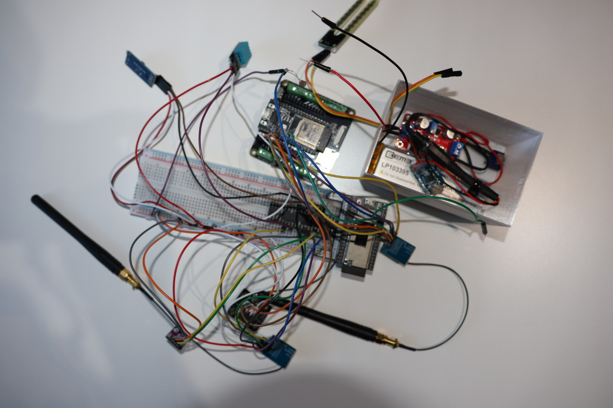

**ESP32 Freenove board with GPIO extension:**
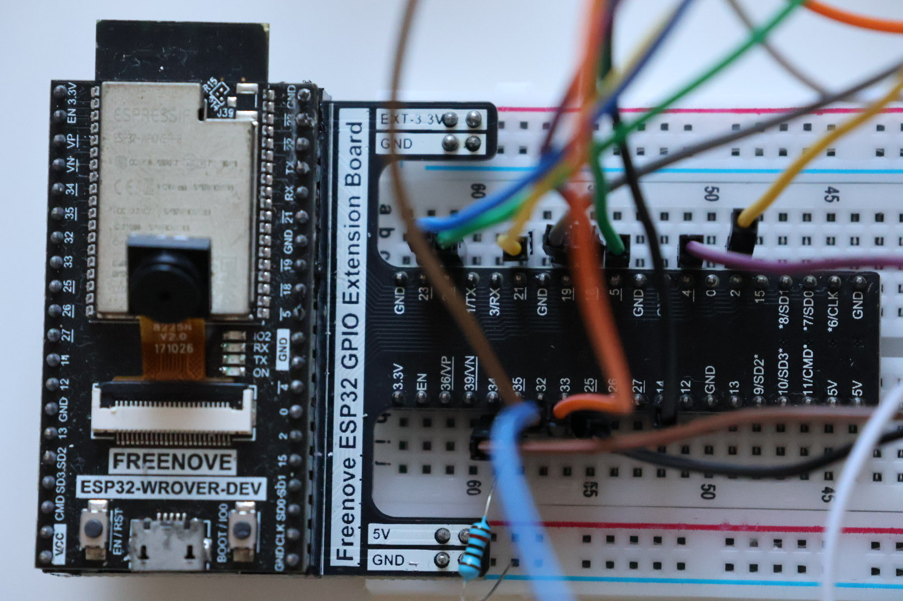

**ESP32 GPIO Extension board:**
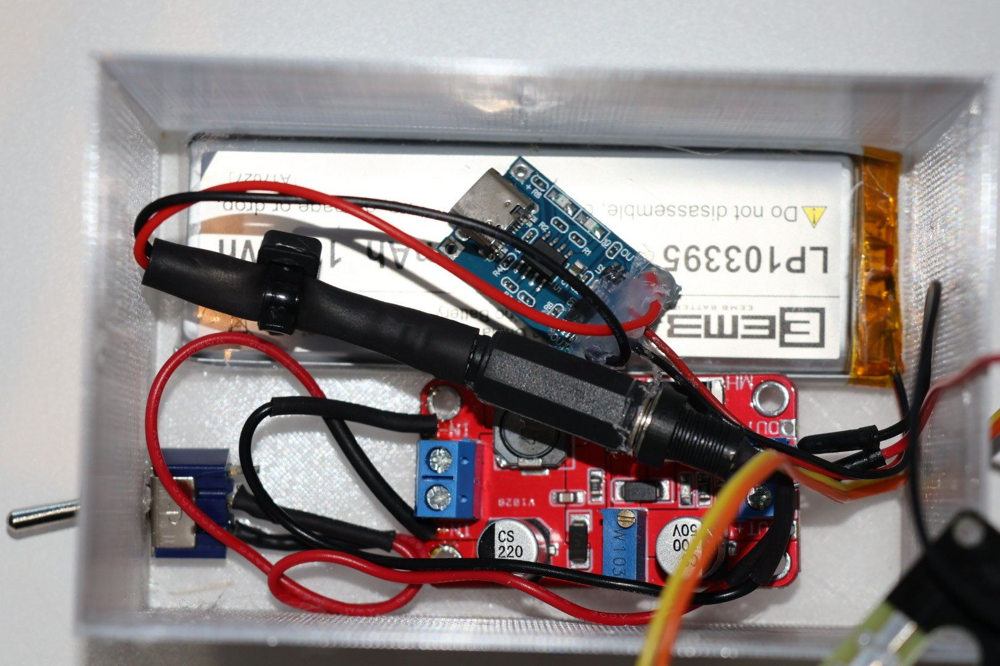

**ESP32 main board overview:**
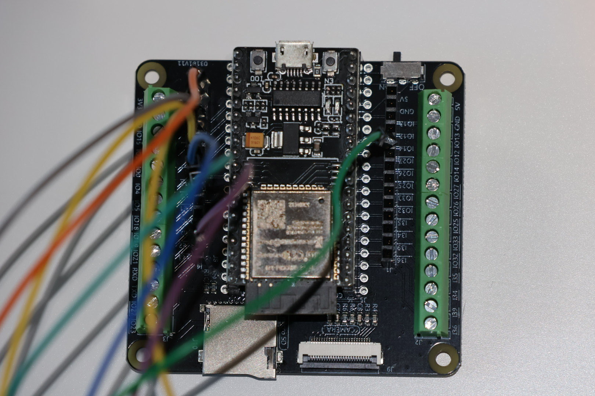

**LoRa module close-up (used on both nodes):**
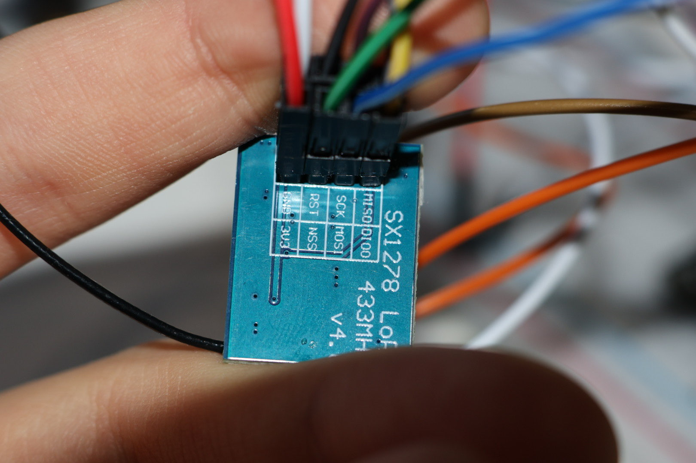

**LoRa Ra-02 module:**
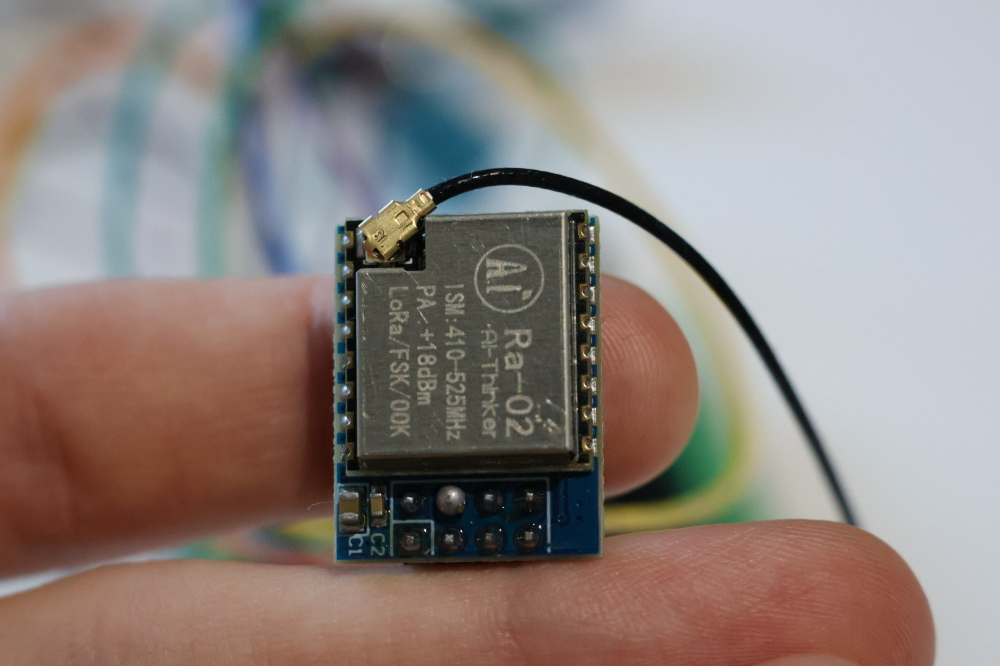

**LoRa Module (same for both nodes):**
Refer to the pin table in `node_sender_design.md` (use **3.3 V only** – **never** use 5 V).

**Sensors on the Sender node:**

**DHT11 Temperature & Humidity Sensor:**
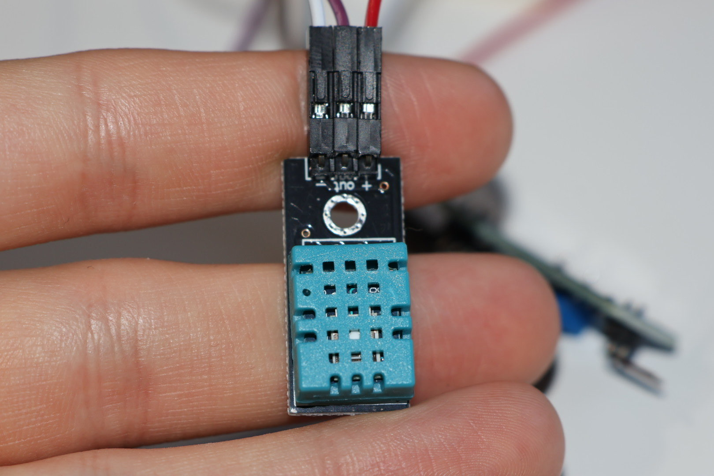

**Soil Moisture Sensor Module:**
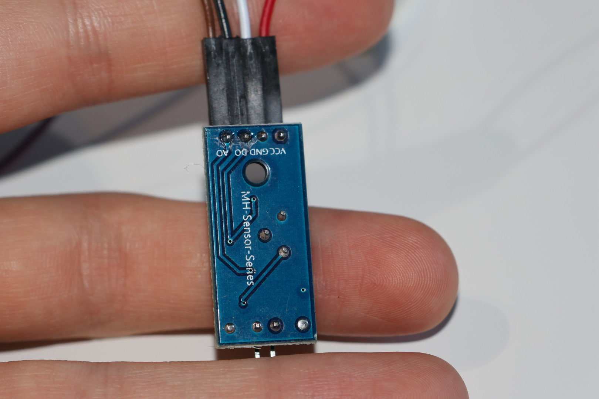

**Soil Moisture Probes (the forks):**
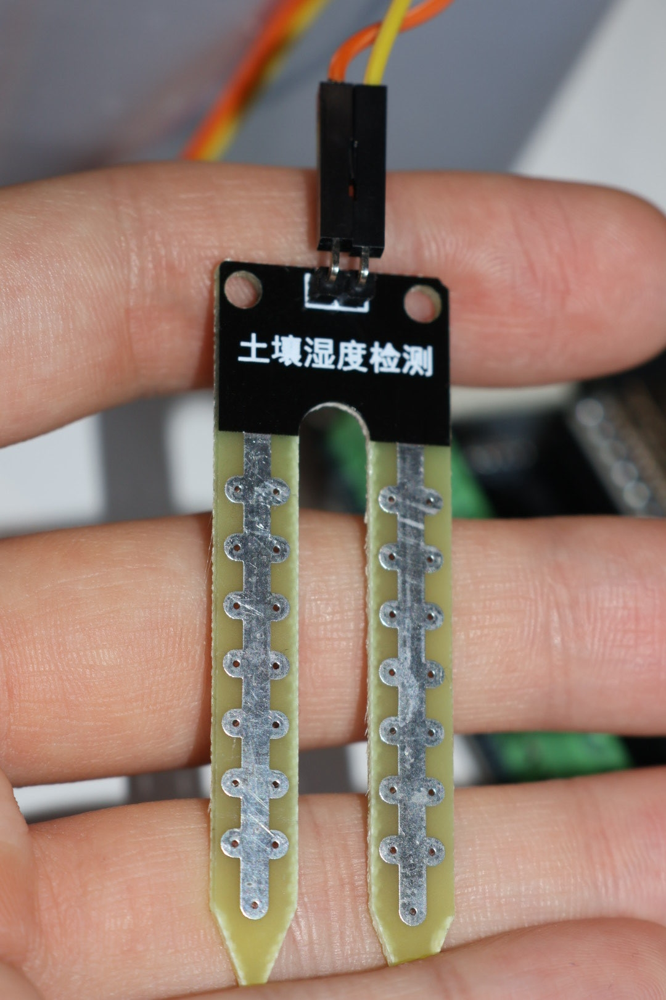

**GY-BMP280 Pressure / Temperature Sensor:**
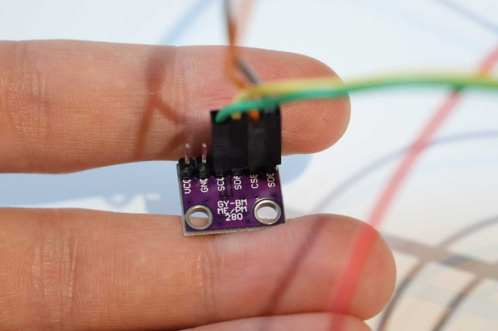

**Photoresistor (bare LDR):**
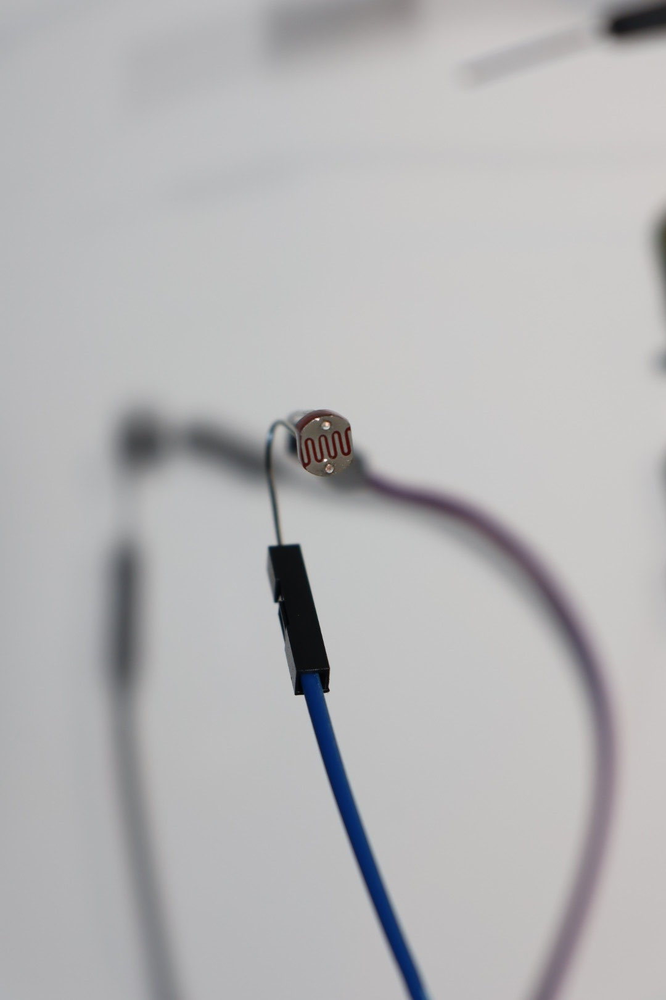

**Photoresistor Module (black PCB version):**
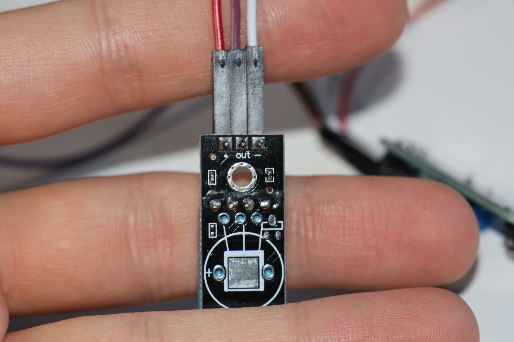

**Pin connections summary (Sender only):**
- GY-BMP280 (I2C): SDA → GPIO21, SCL → GPIO22, CSB → 3.3V, SDO → GND
- DHT11: Data pin → GPIO4
- Soil Moisture (LM393): AO → GPIO34, DO → GPIO25
- Photoresistor: Voltage divider output → GPIO35 (10 kΩ resistor between GPIO35 and GND)

## Software Setup (PlatformIO)
1. Clone the repository and open it in VS Code with PlatformIO extension installed.
2. The project uses one `platformio.ini` in the root with two environments (`sender` and `gateway`).
3. Required libraries (automatically installed by PlatformIO):
    - LoRa by sandeepmistry
    - Adafruit BMP280
    - DHT sensor library

## Build & Upload (Sender only)
In PowerShell / Terminal run:
```powershell
$env:PLATFORMIO_CORE_DIR="$PWD\.platformio-core"
pio run -e sender -t upload --upload-port COM7   # ← replace COM7 with your Sender board's port
```

## Running the Node

1. Power the Sender board (USB or 3.3–5 V supply).
2. Wait 10–20 seconds for the first LoRa transmission.
3. The node will begin sending a packet every 1 second.
4. Verify operation: check the Gateway dashboard for incoming data.

**User control:** Edit the following constants in `src/node_sender/main.cpp`:

- Node name
- Transmission interval
- Altitude calibration offset

## Troubleshooting:

- BMP280 not detected → double-check CSB and SDO pins.
- No LoRa packets → confirm antennas attached and both boards on same frequency.
- Sensor values incorrect → verify wiring against the tables above.

---
